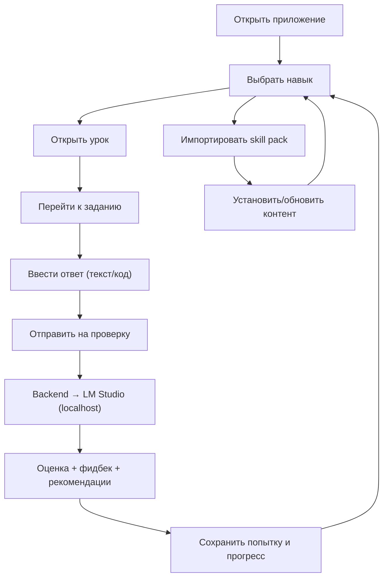

## 1. Обзор продукта
Локальный обучающий курс‑тренажёр для прокачки навыков (React, NestJS, Tailwind, Framer Motion и др.) с практическими заданиями и проверкой ответов через локально запущенный LM Studio.
- Цель: системно учить новые навыки по разделам с нарастающей сложностью и фиксировать прогресс
- Ценность: полностью офлайн по контенту (без внешних запросов), проверка и фидбек выполняются через локальный LLM

## 2. Ключевые возможности

### 2.1 Роли пользователей
Одна роль: локальный пользователь устройства (без регистрации).

### 2.2 Функциональные модули
1. **Каталог навыков**: список установленных “паков” (skills), поиск/фильтры, краткое описание, прогресс
2. **Навык (skill) → разделы**: дерево разделов/уроков с блокировкой/рекомендациями по порядку
3. **Урок**: теория (Markdown), примеры, быстрые заметки
4. **Задания**: формулировка, критерии, поле для ввода текста/кода, отправка на проверку
5. **Проверка через LM Studio**: оценка по рубрике, разбор ошибок, рекомендации, сохранение попыток
6. **Прогресс**: отметки “прочитано”, “сдано”, статистика по навыкам/разделам
7. **Импорт/установка навыков**: загрузка локального пака (zip/папка), проверка структуры, установка/обновление/удаление
8. **Настройки**: адрес LM Studio, модель, параметры проверки (строгость/формат), локальное хранилище, сброс данных

### 2.3 Детализация страниц
| Страница | Модуль | Описание |
|---|---|---|
| Главная | “Продолжить обучение” | Последний активный урок/задание, быстрый переход, напоминания |
| Навыки | Каталог | Список паков, прогресс по каждому, фильтры по тегам/уровню |
| Навык | Программа | Разделы и уроки, порядок, требования, прогресс по разделам |
| Урок | Контент | Markdown‑контент, примеры, мини‑проверки (если есть) |
| Задание | Решение | Поле ввода текст/код, кнопка проверки, история попыток, эталон/подсказки (если предусмотрено) |
| Импорт | Установка пака | Выбор zip/папки, предпросмотр метаданных, установка/обновление |
| Настройки | LM Studio | Endpoint, модель, таймауты, шаблоны промптов/формат ответа, диагностика подключения |

## 3. Основные сценарии (Core Process)
1. Пользователь открывает “Навыки”, выбирает установленный навык
2. Заходит в урок, читает теорию
3. Переходит к заданию, вводит ответ (текст/код) и отправляет на проверку
4. Приложение вызывает локальный backend, тот обращается к LM Studio, получает оценку и фидбек
5. Результат сохраняется как попытка, прогресс обновляется
6. Пользователь импортирует новые навыки из локального файла (skill pack)

## 4. Дизайн интерфейса

### 4.1 Стиль
- Направление: “редакционный тренажёр” — строгая типографика, много воздуха, акцент на читаемости и структуре
- Тема: светлая по умолчанию + тёмная (переключатель)
- Цвета: нейтральная база (графит/серый) + один акцентный (например, цитрин/лайм) для прогресса и CTA
- Типографика: выразительный заголовочный шрифт + нейтральный для основного текста (уточняется на этапе реализации)
- Анимации: аккуратные переходы между уроками/разделами и раскрытиями (Framer Motion), без лишней “прыгающей” микродинамики

### 4.2 Обзор элементов по страницам
| Страница | Модуль | UI элементы |
|---|---|---|
| Главная | Продолжить | большая кнопка “Продолжить”, карточка текущего навыка, прогресс‑бар |
| Навыки | Каталог | список навыков с прогрессом, теги, поиск |
| Навык | Программа | дерево/список разделов, “замки”/рекомендованный порядок, проценты |
| Урок | Контент | читабельный Markdown‑рендер, блоки примеров, “следующий шаг” |
| Задание | Решение | редактор ответа (textarea/код), “Проверить”, панель результата, история попыток |
| Импорт | Установка | dropzone, предпросмотр, конфликт версий, кнопки установить/обновить |
| Настройки | LM Studio | поля endpoint/model, кнопка “Проверить подключение”, параметры проверки |

### 4.3 Адаптивность
Desktop‑first, затем адаптация под узкие экраны: колонка → один столбец, удобные зоны нажатия, сохранение читабельности уроков.

## 5. Требования к контент‑паку (Skill Pack)
- Пак устанавливается локально из zip (или папки) и сохраняется в локальное хранилище приложения
- В паке есть метаданные (id, версия, название, теги), структура разделов/уроков, задания и рубрики
- Контент хранится в формате Markdown/JSON, чтобы его можно было создавать вручную без сети
- Возможность обновления: если id совпадает, а версия выше — предложить обновить
