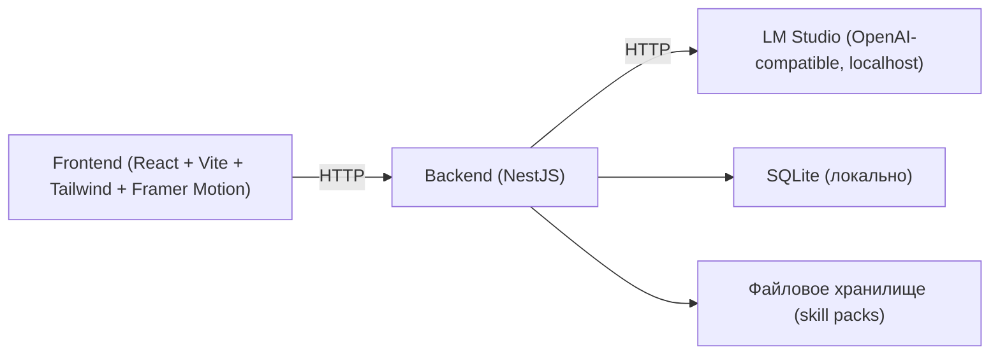
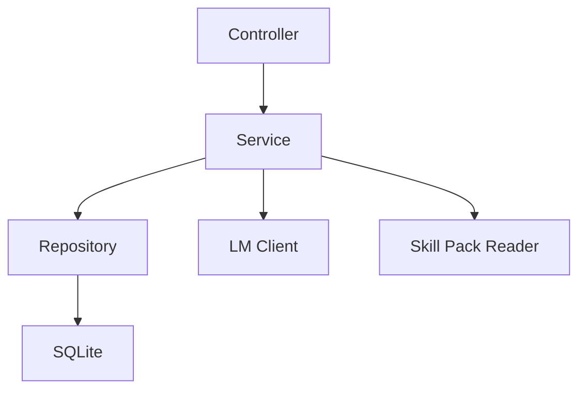
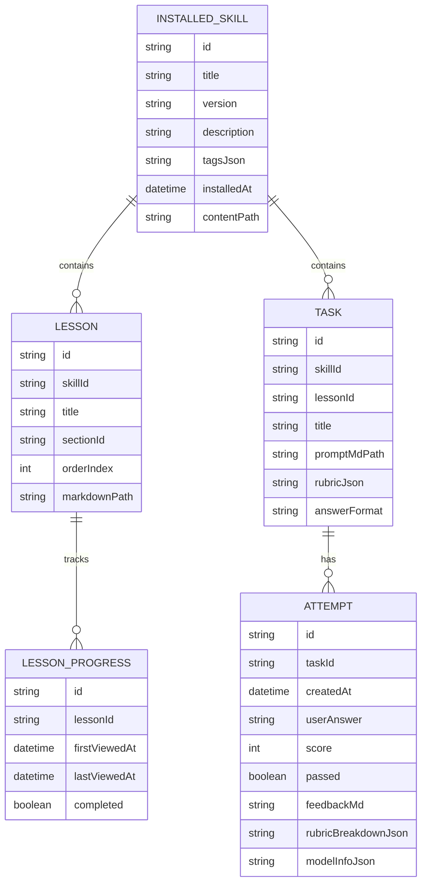

## 1. Архитектура

Ключевая идея: контент уроков и заданий хранится локально (skill packs + БД), а проверка ответов выполняется через локальный backend, который проксирует запросы в LM Studio и нормализует результат.

## 2. Технологии
- Frontend: React + TypeScript + Vite, Tailwind CSS, Framer Motion
- Backend: NestJS + TypeScript
- Хранилище:
  - SQLite для прогресса, попыток, индексации контента и установленных паков
  - Файловая система для содержимого паков (Markdown/JSON)
- Интеграция LLM: HTTP к localhost эндпоинту LM Studio (OpenAI-compatible)

## 3. Роутинг (Frontend)
| Route | Назначение |
|---|---|
| / | Главная/продолжить |
| /skills | Каталог навыков |
| /skills/:skillId | Программа навыка |
| /skills/:skillId/lessons/:lessonId | Просмотр урока |
| /skills/:skillId/tasks/:taskId | Выполнение задания |
| /import | Импорт skill pack |
| /settings | Настройки |

## 4. API (Backend)

### 4.1 Skills / Content
- GET /api/skills: список установленных навыков + прогресс
- GET /api/skills/:skillId: метаданные навыка + структура разделов/уроков
- GET /api/lessons/:lessonId: урок (Markdown + метаданные)
- GET /api/tasks/:taskId: задание (описание, рубрика, подсказки, формат ответа)

### 4.2 Progress / Attempts
- GET /api/progress/summary: агрегированный прогресс
- POST /api/progress/lesson-viewed: отметить урок прочитанным
- GET /api/tasks/:taskId/attempts: история попыток
- POST /api/tasks/:taskId/attempts: создать попытку (ответ пользователя + результат проверки)

### 4.3 Skill pack import
- POST /api/import: загрузка zip, валидация структуры, установка/обновление
- DELETE /api/skills/:skillId: удалить навык (опционально с сохранением прогресса)

### 4.4 LM Studio check
- POST /api/check:
  - request: { taskId, userAnswer, context? }
  - response: { score0to10, passed, feedbackMd, rubricBreakdown, suggestedNext, raw? }
- GET /api/llm/health: проверка доступности LM Studio и базовых параметров (без вывода секретов)

## 5. Серверная структура (NestJS)

## 6. Модель данных

### 6.1 ER-диаграмма

### 6.2 Формат skill pack (файловая структура)
- skill.json (id, version, title, description, tags, sections)
- lessons/<lessonId>.md
- tasks/<taskId>.json (metadata, rubric, answerFormat) + tasks/<taskId>.md (условие)
- index.json (опционально, для быстрого чтения/валидации)

## 7. Промптинг и формат ответа LLM
- Проверка строится на рубрике задания: критерии, вес, минимальный порог “passed”
- Backend формирует системный промпт: роль “строгий ревьюер”, ограничения (не галлюцинировать факты), требование вернуть строго JSON
- Рекомендуемый ответ LM Studio: JSON schema
  - score0to10 (0–10)
  - passed (boolean)
  - rubricBreakdown (массив критериев: name, score, notes)
  - feedbackMd (короткий разбор с примерами улучшения)
  - suggestedNext (что учить дальше/какой урок повторить)

## 8. Офлайн‑ограничения
- Контент‑пак, БД и вся логика приложения работают без сети
- Единственные HTTP‑запросы — к localhost (frontend → backend, backend → LM Studio)
